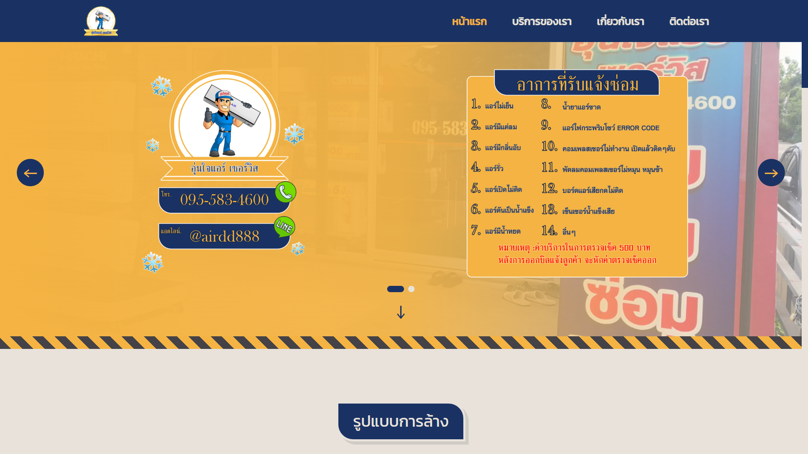
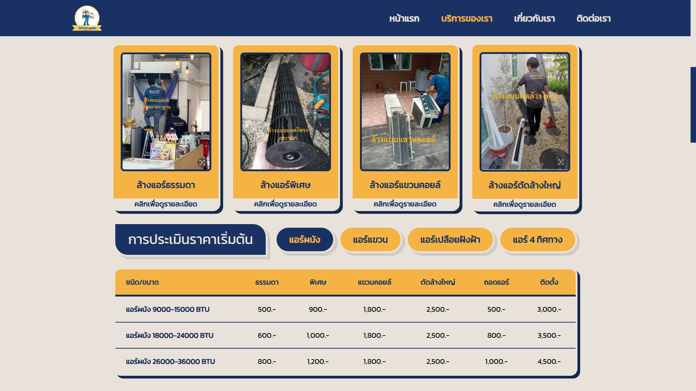
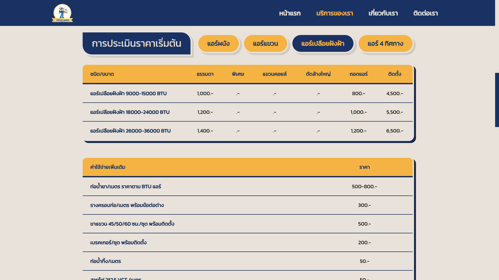
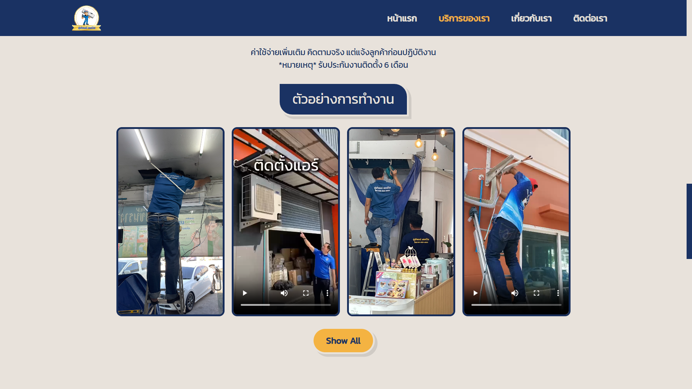
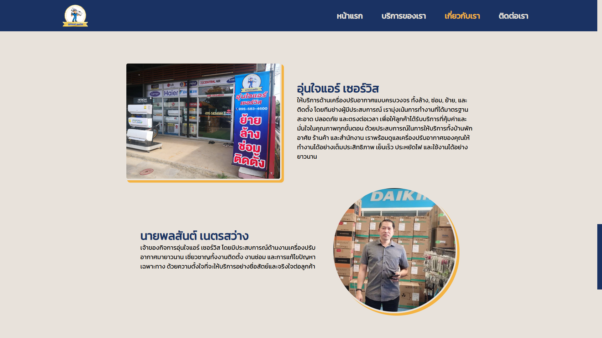
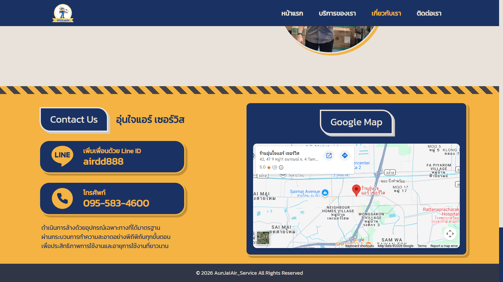

# ❄️ AunJaiAir Service

  

  
  
  
  

---

## ✨ Overview

AunJaiAir Service is a business landing page developed for an air conditioner installation and maintenance service provider.

The website provides customers with a simple and informative experience by presenting available services, transparent pricing, and useful information about air conditioner maintenance. It also offers convenient ways for customers to contact the service provider directly for inquiries or service requests.

Designed with a clean and responsive interface, the website focuses on helping customers quickly find the information they need while building trust through clear service descriptions and pricing.

## 📄 Website Sections

| Section       | Description                                                                  |
| ------------- | ---------------------------------------------------------------------------- |
| **Home**      | Introduces the company and its air conditioning services.                    |
| **Services**  | Presents available installation, cleaning, repair, and maintenance services. |
| **Pricing**   | Displays clear and transparent service pricing.                              |
| **Knowledge** | Shares basic information and maintenance tips for air conditioners.          |
| **Contact**   | Provides contact information for inquiries and bookings.                     |

## 🌐 Live Demo

Visit the website:

**https://aunjaiair.vercel.app/**

## 🖥 Built With

<table>
<tr align="center">
<td width="120">

</td>

<td width="120">

</td>

<td width="120">

</td>
</tr>

<tr align="center">
<td>React</td>
<td>Tailwind</td>
<td>Vercel</td>
</tr>
</table>

## 📸 Screenshots

<table>
<tr>
<td align="center">

 <b>Homepage</b>
</td>

<td align="center">

 <b>Services</b>
</td>

</tr>
</table>

<table>
<tr>
<td align="center">

 <b>Pricing</b>
</td>

<td align="center">

 <b>Example</b>
</td>

</tr>
</table>

<table>
<tr>
<td align="center">

 <b>About Us</b>
</td>

<td align="center">

 <b>Contact</b>
</td>
</tr>
</table>

## 📄 License

This project is licensed under the [MIT License](LICENSE).
